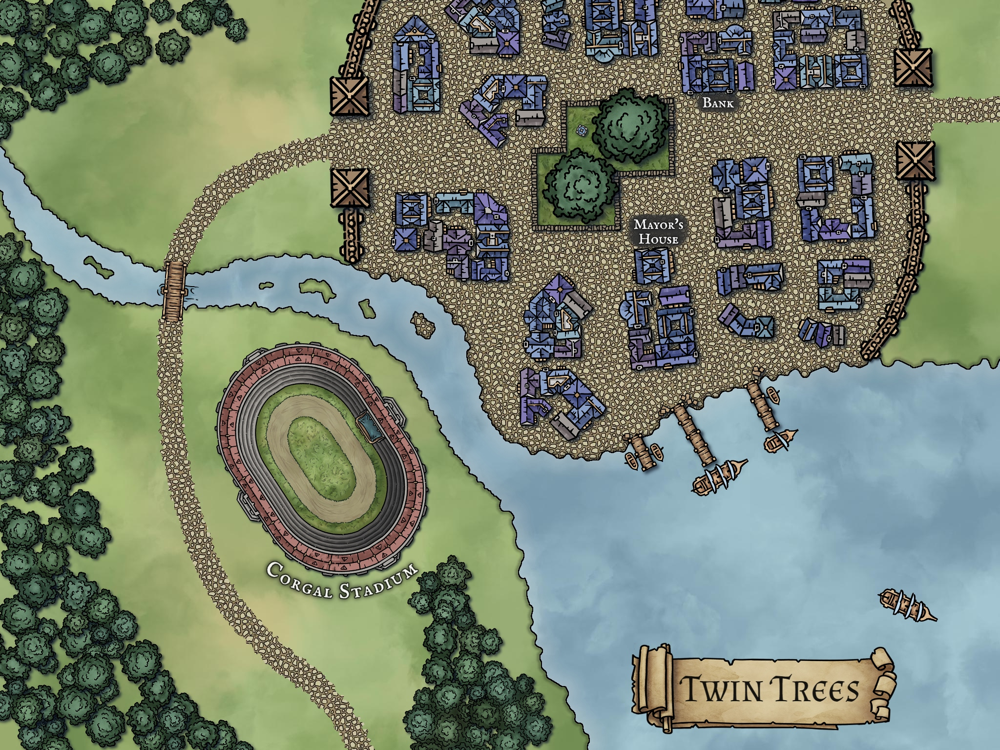

 

Morning sunlight filters through the fiery leaves of maple trees surrounding the small town, scattering deep orange light across the wood-shingled roofs of shops scattered along the edges of the main street. You recognize some standard local signage above shop doors: a butcher, a general goods shop, an apothecary, and a bank, among others.

In the center of a roughly cobbled town square, two massive trees tower above nearby buildings. A few townspeople with early morning errands bustle up and down the road, with many more sitting outside and enjoying the brisk autumn air before starting their day in earnest.

Off the main road, a variety of modest homes are organized into clusters of four to eight buildings, with small communal green spaces and gardens between them. Breakfast smoke rises from chimneys and children play outside before being called in for their morning meal.

Down by the lake's edge, a moderately sized set of docks extends some 50 feet into the deep waters. Small fishing boats bob close to shore, securely tied to the dock, watching over neat piles of fishing nets. At the end of the largest pier, a three-masted merchant vessel sits low in the water, likely loaded with goods from the city of Preldon, a trading hub at the eastern edge of the lake and near the border of Dufastan.

This is the charming town of Twin Trees: a picturesque village nestled between the forest and the great lake, a quiet farming community, and a popular tourist destination. Some travelers visit to escape the noise of the city, to walk in the nearby woods, or to purchase fresh produce from the farms nearby, but most out-of-towners are here for something else entirely.

Just outside of town, in a large venue specially constructed for the occasion, crowds gather to watch (and gamble on) the weekly corgal races. Originally bred from dogs to be a smart and energetic work animal, corgals are pony-sized corgis that have lost none of their ancestral temperament or personality. Fluffy, stubby, and surprisingly speedy, the local corgals provide an adorable spectacle that attracts families, curious travelers, and even a few degenerate gamblers.
