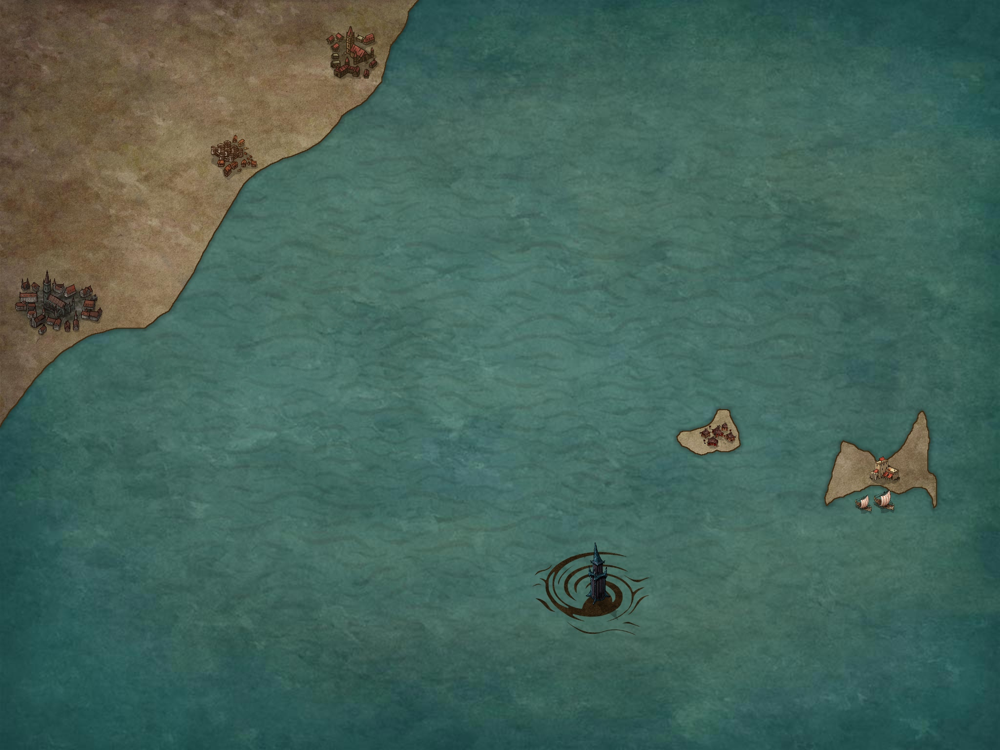

# Rebleux

- Temperate climate 
- Diverse town: humans, elves, dwarves, gnomes, halflings, etc 
- Sewers and secret tunnels running underneath the city 

### Surrounding Area

- Rolling hills, vineyards, nearby mountains 
- Vineyards and estates owned by merchant houses 
- Metal deposits in hills 
- Not much timber or stone usable for building 

### Surrounding Coast

### Government

- Financial Regent elected by Merchant's Council 
- Merchant's Council (merchants from prominent houses) are in charge of making laws and acting as a court of judges for matters they deem important 
- Justicars oversee any contract, business deal, or formal agreement (anytime papers are signed). Also anytime someone is employed. New businesses must be approved or they cannot do business (repossesed if this law is broken). 

### Law

- Guard captain controls all guards. 
- Guard undercaptains oversee sections of the city. 
- Squad leaders are responsible for squads. 
- Standard guards patrol and keep the peace. 

### Trade

#### Exports
- Wine
- Weapons
- Mechanical toys, gadgets, and curios

#### Imports
- Food
- Building materials (wood, stone)

### Social Heirarchy
  1. Financial Regent
  2. Council of most powerful merchants
  3. Merchants with established houses
  4. Healers
  5. Mages
  6. Clanless merchants
  7. Shopowners, crafters
  8. Guards, mercenaries
  9. Employees, laborers

### Landmarks

- Tower of the Magi
- Halynn's Square

### Neighborhood Maps

