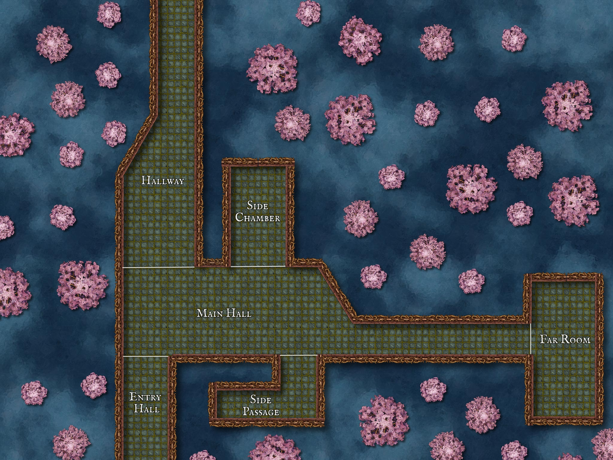
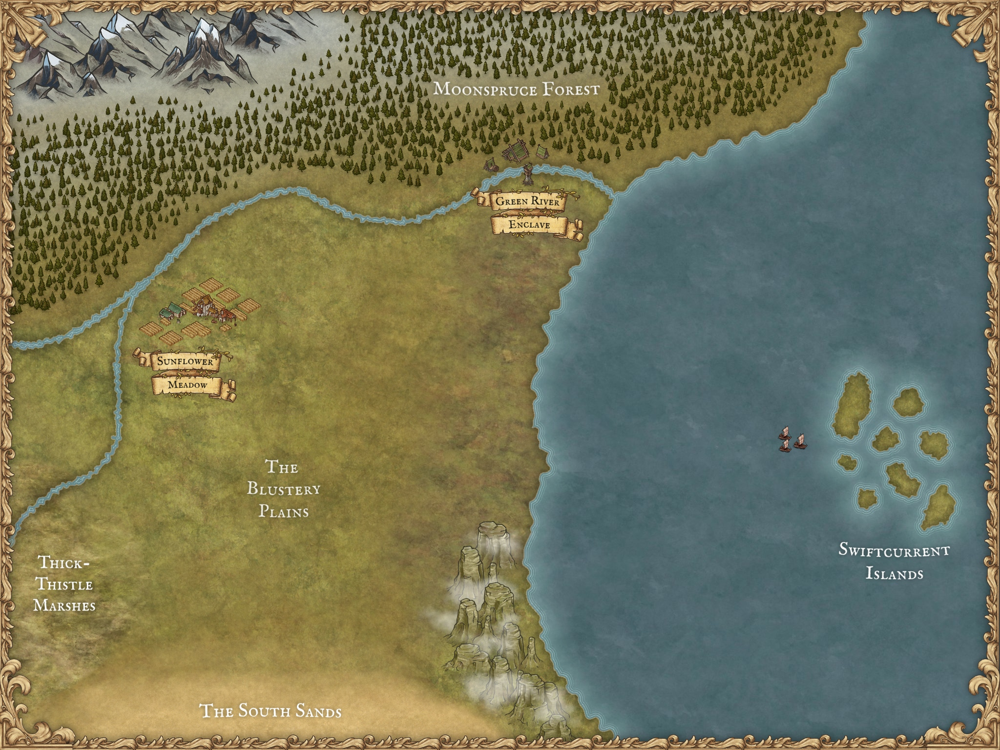
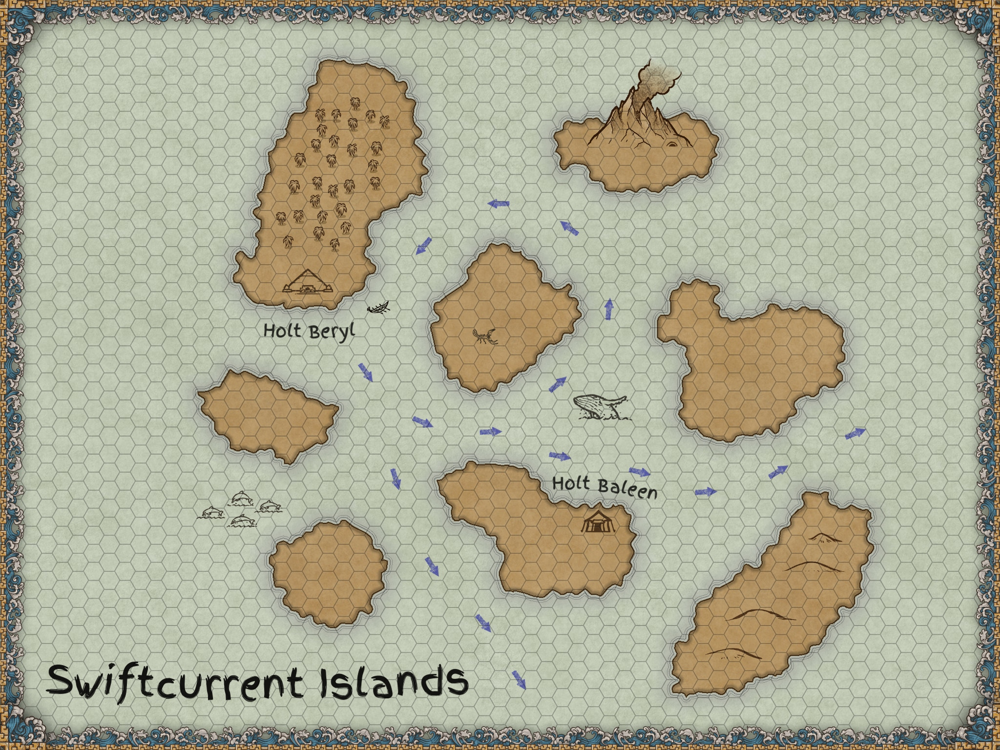

## Overview

Areas are how we represent space in the world. We can split any map or space into areas that the characters can move between using grids, hex-grids, labels, lines, or any markes that helps to distinguish between different sections of a space.

Vaguely defining areas allows some flexibility in how we split up a space. We can separate a space into pieces that conform to that space, rather than having to design our map to neatly fit into a grid. We can describe the map and character movement to fit the narrative and we don't need to keep track of how many feet away each enemy is from each character.

## Using Areas for Combat

As a starting point, imagine each area in a combat map to be vaguely 20-60 feet wide. Consider what sections of the map naturally feel like different places, such as the different rooms and hallways of a building, and then imagine how the players will move through the space. Pretend you are describing the scene and think about how you would verbally differentiate the sections of your map.

If you are primarily using this space for combat, then it may be a good idea to define areas of the map based on how the players will strategically approach the situation. Or, perhaps you want to focus on the players investigating a location to find different clues or make their way past a series of traps. Keep in mind what your players will be doing in this space as you break it up into different areas.

### Combat Range in Areas

Combat action range limitations are described with areas as a unit of measurement. When running a combat with areas, we allow our players to make melee attacks on enemies in the same area without worrying about the details of movement. When a player says "I want to attack this enemy", it is understood that their character will move to enable that attack to happen. 

If there is a specific factor preventing the player's movement within an area, the narrator and player can decide how to proceed. For example, if the player's character is tied up, perhaps the player needs to use their turn to perform a skill check to free themselves. If there are spikes on the ground in the area, perhaps the character can move through the area, but will need to make a skill check when they attack to determine if they step on a spike and take damage.

Similar to melee weapon attacks, when a player wants to use a ranged weapon or combat action, there is mutual understanding that the player's character is moving freely within its current area, and that enemies are generally existing within the entirety of their area. If we imagine a bow to have a range of 60 feet and our areas to be vaguely 20-60 feet wide, we can imagine that during the player's turn, it was possible for their character to move within 60 feet of the enemy before attacking.

#### Weapon Range Limit Examples

| Weapon        | Range                |
| ------------- | -------------------- |
| Melee Weapons | Within the same area |
| Sling         | 1 area away          |
| Crossbow      | 2 areas away         |
| Bow           | 2 areas away         |
| Longbow       | 3 areas away         |

The narrator and player should work together to determine if the player's character can reasonably see an enemy from their area, or if there are any factors hindering the player's ability to attack an enemy. Here are some examples with suggested penalties. The narrator should use their own judgement to adjust these to fit the situation or their preference.

| Situation                                              | Penalty                                                                                         |
| ------------------------------------------------------ | ----------------------------------------------------------------------------------------------- |
| No line of sight to enemy                              | Character cannot attack the enemy                                                               |
| Player character's feet are restrained                 | +2 to the Skill Roll Minimum                                                                    |
| Enemy partially hiding behind cover                    | +2 to the Skill Roll Minimum for attacking                                                      |
| Enemy is in a shield wall formation with other enemies | +4 to the Skill Roll Minimum for attacking                                                      |
| Combat takes place during an intense storm             | +1 to the Skill Roll Minimum for melee attacks, +3 to the Skill Roll Minimum for ranged attacks |

Here is a combat map, with line of sight examples listed below.

- A player in the Hallway cannot see an enemy in the Side Chamber.
- A player in the Main Hall can attack an enemy in the Side Chamber with an appropriate ranged weapon. There is no place in the side chamber that the enemy can hide where they cannot be seen by the player in the Main Hall.
- A player in the Main Hall _might_ be able to see an enemy in the Side Passage. If a player wants to attack an enemy in the Side Passage, the narrator should communicate if the enemy is trying to hide or is confronting the player. If the enemy is hiding, they might be at the very end of the Side Passage and the player will need to move into the area to be able to see them. If the enemy is confronting the player, they may be standing at the entrance to the side passage and can be seen from the Main Hall.

Keep in mind that the narrator could divide this same map into different areas that more closely represent the walls of these rooms, such that line of sight would be easier to talk about and keep track of. The narrator should consider the playstyle of the players in their group when deciding how to divide a space.

For players that want a more detailed or strategic combat scenario, it could be a good idea to make a more detailed map that provides strategic options for your players. Also consider options for strategy that are not based on movement speed or distance. Add environmental hazards, hiding spots, defensive locations, very brightly lit or poorly lit areas, or other thematically appropriate features to your map. Then, the narrator can decide (on their own or with the players) what bonuses or penalties seem fair for those map features.

We do lose a lot of strategic complexity by making our positioning a more vague, but our style of game is narratively-focused and we can increase the pacing of combat by simplifying player decision-making.

However, if you and your table want a more strategic fight, you can use a traditional grid/hex map. Define an area to be 30 feet and convert any areas measurements to a measurement in feet. Below is an example of the Swimming skill and the above Weapons table using feet instead of areas. Keep in mind that these are just approximations - if a narrator and players feel like a longbow should have more range than 90 feet, then increase it to match what feels right.

#### Weapons (measured in feet)

| Weapon        | Range               |
| ------------- | ------------------- |
| Melee Weapons | In an adjacent tile |
| Sling         | 30 feet             |
| Crossbow      | 60 feet             |
| Bow           | 60 feet             |
| Longbow       | 90 feet             |

#### Swimming (measured in feet)

| Title               | Description | Rank   | Action Cost |
| ------------------- | ----------- | ------ | ----------- |
| Standard Swim Speed | 15 feet     | Novice | 1           |
| Improved Swim Speed | 30 feet     | Adept  | 1           |
| Expert Swimmer      | 60 feet     | Expert | 1           |

## Using Areas for Travel

Travel between locations on a world map can be approximated by the narrator. It can be helpful to first choose two locations and decide how long it would take the players to travel from one to the other. Then, use that distance as a reference when approximating travel time between other locations on the map.

Here is a regional map with distance examples below.

| Starting Location   | Destination           | Travel Time (by foot) |
| ------------------- | --------------------- | --------------------- |
| Sunflower Meadow    | Green River Enclave   | 7 days                |
| Sunflower Meadow    | The Blustery Plains   | 4 days                |
| Sunflower Meadow    | Thick-Thistle Marches | 7 days                |
| Sunflower Meadow    | The South Sands       | 10 days               |
| Green River Enclave | The South Sands       | 14 days               |

My "reference distance" was the distance between Sunflower Meadow and Green River Enclave.

It can be helpful to first measure based on the most common form of travel for your players. If they are temporarily traveling in a different method, such as by boat, imagine how much faster that method of travel is than walking. Consider, for the boat example, if they are traveling with or against the current or if the wind is favorable. Try to describe to your players some of the factors affecting their travel, even if the travel will be mostly skipped over. Below is an example of distance for players traveling along the Green River between the two towns on the map.

| Starting Location   | Destination         | Travel Time (by canoe) |
| ------------------- | ------------------- | ---------------------- |
| Sunflower Meadow    | Green River Enclave | 2 days                 |
| Green River Enclave | Sunflower Meadow    | 4 days                 |

In this example, we take into account that the current is running towards the ocean. Imagine how fast the current is in the river and adjust the travel time to what feels right.

Sometimes travel can be a factor that creates narrative situations for your players. You can guide them towards interesting or notable locations while still giving your players the freedom to explore the map. By defining some mechanics behind player travel, you can give players the opportunity to make decisions that feel impactful and provide some flavor to moving around the map. It can help give a memorable or unique feeling to a certain area of your world or an arc of your story.

As the narrator, you can use environmental factors to gently guide your players, indicating to them "Hey, there is something cool over here that I've prepared for you to enjoy" and letting them choose to engage with it, rather than having them feel forced down a pre-determined path. 

Having some simple mechanics behind traveling can also give the narrator a layer to obscure their influence on the direction the story will take. The most important goal is for the players at the table to have fun, and it's helpful for the narrator to be able to exert some guidance over the story so they can create a fun and satisfying experience for the players.

You can apply a square or hexagonal grid to a map, like in the below example.

In this case, I added blue arrows to represent the ocean currents. My players acquired a small boat in Holt Beryl and I wanted them to explore the unmarked areas of the map, even though they didn't have a narrative reason to do so. I let the players choose between a rowboat and a sailboat (either way the current becomes a factor) and I can provide a penalty for traveling against the current. If the players choose to travel against the current, we can create some narrative situation out of that, and the players' decision will make a difference in how the story unfolds. If the players follow the current, they'll pass by the big volcano island and I can present it as an interesting location to explore. Either way, the story has changed because of the player's decisions about travel.

Physical exhaustion can also be a factor that creates decisions for the players that can change or create narrative. A grid to represent distance helps focus on a mechanic like physical exertion by representing distance more specifically. Do your best to imagine what kind of decisions your players will enjoy and invent factors that create those types of decisions.
