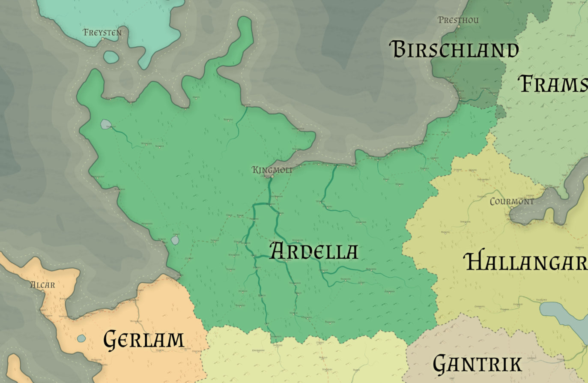

# Ardella

Racial Majority: Elven (Wood elves), pixies, sprites

Geography: Thick forest, mixed pine/deciduous

Covered in thick forest that has been cultivated for hundreds of years, Ardella is the stronghold of the wood elves of Eryst.  The wood elves of Ardella act as sentinels and guardians of the forest, keeping the realm safe for the beasts and fey creatures that live there.  Ardella is free of evil creatures, but home to many proud and fierce beasts that demand the respect of residents and travelers alike.  Wood elves prefer to live in harmony with the forest, reflected in the natural construction of their towns and cities.  Ardellan settlements are grown from the living wood, often shrouded in glamours and illusions that make them impossible for unwanted travelers to find.
Ardella is ruled by a council of elders, druids and veteran rangers. Each group makes up one third of the council.  The elders primarily represent the interests of the people, the druids speak for the well-being of the forest, and the rangers ensure the safety of the realm against outside forces (mainly Orcish raiding parties from Gantrik and human bandits from Fallona and Hallangar).

The forests of Ardella are self-sufficient and mostly closed to outside travel, but halflings from Birschland are held in good standing due to their love of peace and farming. High elves from Estilia occasionally travel to Ardella to visit their woodland relatives, or stay there while on their way to Hvammsund.