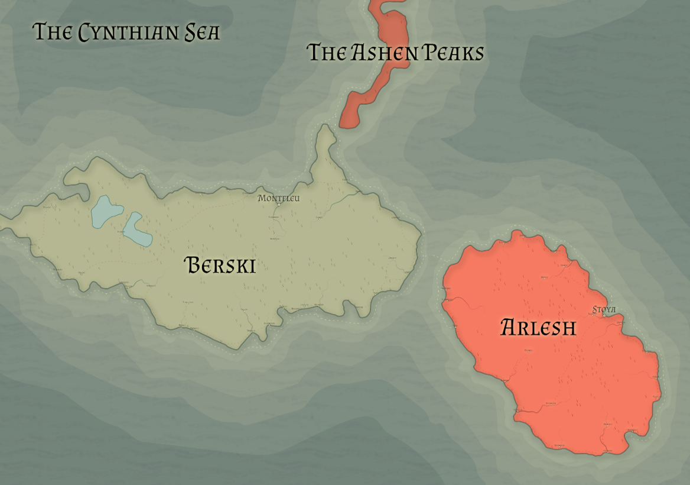

# Arlesh

Racial Majority: Fire giants

Geography: Volcanoes, barren, ash

Before the First Era, when deities could interact more directly with the material plane, the deity Amrott sculpted the land of Arlesh into a home for the fire giants, who have long worshipped him with great fervor. Their culture is dedicated to crafting and each fire giant chooses a craft upon reaching adulthood.

Due to their affinity with fire, heat is incorporated into crafting for most fire giants. Metalworking and glassblowing are popular choices, but fire giants find a way to incorporate heat into woodworking, stonework, and many other crafts.

So Amrott raised three volcanoes across the land of Arlesh, made the caverns beneath the stone plains rich with all types of metal ore, created great trees to match the size of his followers, and made great mountains of flawless stone of all varieties.

Blessed with an abundance of natural resources and raw magma to fuel their massive forges, the fire giants built truly remarkable cities of stone and metal that surpass even the dwarven cities of the continent. Isolated from the conflict of the continent, with only the tumultuous land of Berski to the north posing no threat, fire giants have been able to focus solely on their crafts for centuries.
