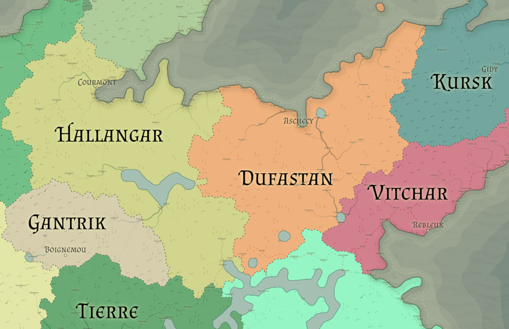

# Dufastan

Racial Majority: Human

Geography: low mountains, farmland

Dufastan is a relatively unremarkable kingdom.  It possesses neither the trade wealth of nearby Vitchar, nor the noble lineage and knightly orders of its sister kingdom, Hallangar.  A primarily human land, most Dufastanians are farmers, shepherds, or simple crafters.  Dufastanians are generally resigned to their position in life and frown upon those who stir up trouble or propose new ideas.  Although the culture is industrious and values construction and craft, the people dislike ingenuity or creativity.

Those who have a hard time following laws often leave for the thriving ports of Vitchar, where any able-bodied commonfolk can find work as a sailor or at one of the merchant companies.  A common person bored with a simple life can pursue a more adventurous career as a soldier in one of the numerous mercenary companies throughout Dufastan. These mercenary companies provide training, housing, and pay for those who agree to serve for a minimum of 4 years.  They operate mainly in Hallangar fighting against the Orcs of Gantrik and the various evil peoples of Tierre.  Companies that aren’t able to secure a contract with Hallangar may hire out to powerful Vitcharian merchants to act as household or caravan guards, or rarely to the dwarven kingdom of Kursk to aid in their fight against the southern Kyrgann goblins.
While Dufastan does not share borders with Gantrik or Tierre, raiding parties from both regions periodically cross into Dufastan when old hunting grounds become stale.  Most mercenary companies are responsible for the lands that surround their training grounds, so it falls to those companies to protect the villages on their lands from bandits and raiders.  The more honorable and prosperous companies hire builders from nearby towns to construct sturdy fortresses, many of which are large enough for commonfolk to retreat to in times of emergency.
Dufastan is ruled by a king, but the monarchy does not directly control most of the region.  Instead, Dufastanian kings govern their own fiefdom and delegate rule of other areas to well-known or prosperous mercenary companies.  Leaders of these companies act as minor nobles, enforcing (or not enforcing) the law in their controlled lands and pay yearly taxes to the king.
