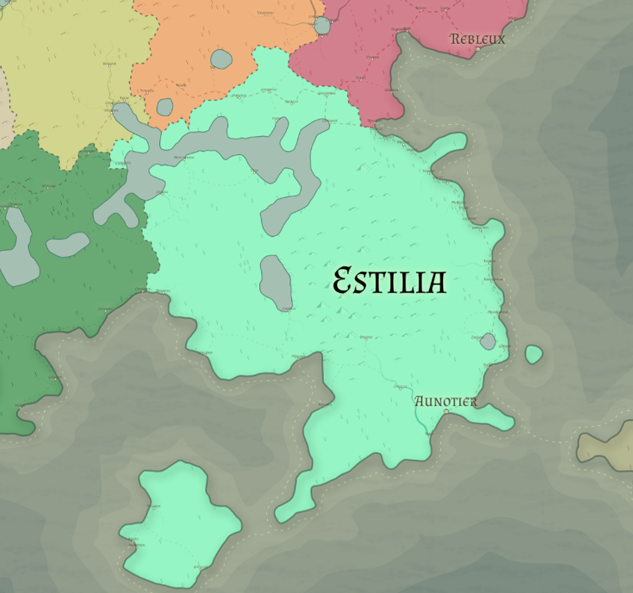

# Estilia

Racial Majority: Elven (High elves)

Geography: Mediterranean

Estilia is the area containing the city-states of the high elves of Eryst.  Each city state is distinct, but they share similar cultural elements. Estilian architecture typically favors white stone, tall towers, and graceful arches.  Elves in Estilia place high value on manners – long lives mean long memories, so perceived insults or slights may cause family feuds that last decades.  Lineage is important to Estilian elves, and the most important political figures of each city state can trace their bloodline back for generations.  Most Estilians desire political power for themselves and their descendants, laying the groundwork for long-term plans and reaping the benefits of plans laid by their ancestors (or paying the price for past plans gone awry).

High elves in Estilia give great importance to the arts and the humanities.  They respect the classical arts (painting, music, sculpture, etc) as well as philosophy, literature, and music.  They have don’t have much respect for craftsman or merchants and a distaste for farming and labor work, considering their culture as having surpassed the need for those occupations.  They import most of their food from Dufastan and Hallangar, as well as wine and other luxury items from Vitchar.  In return for goods, Estilian elves perform magical services at a high price.  Powerful and rich families from other realms hire lesser Estilian politicians to act as impartial judges in important disputes, as high elves are respected, especially in human kingdoms, for their intelligence and ability as politicians.  Lastly, traders are required to pay city states for permission to trade in that city (which rich traders are willing to do, given that many magical or unique items can only be found in Estilian cities and fetch high prices elsewhere).