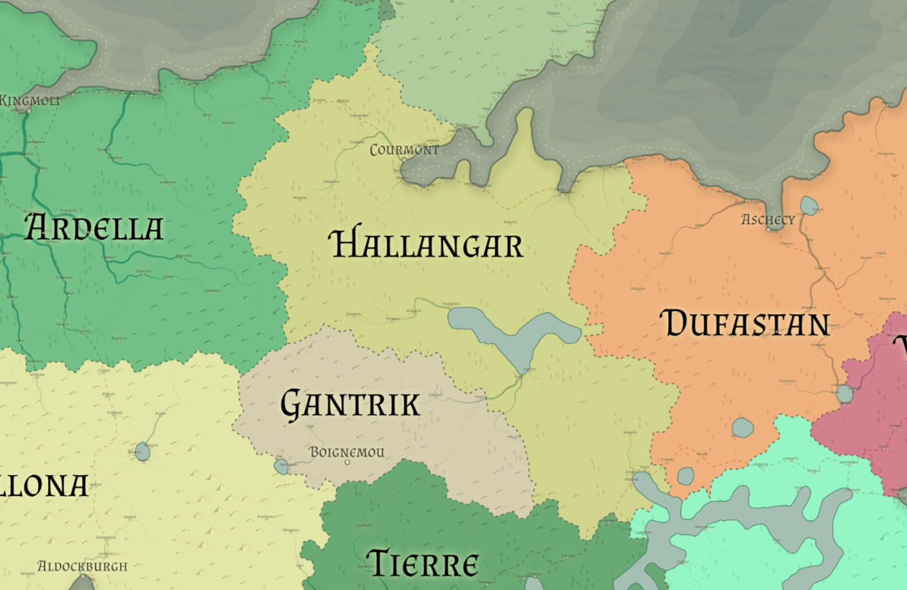

# Hallangar

Racial Majority: Human/Halfling

Geography: Deciduous forest, hills, mixed geography, temperate

The noblest of the human-centric nations, Hallangar is a land with a history of chivalry, monarchy, and military achievement.  Members of the aristocracy do not need much encouragement to begin recounting the heroic deeds of their ancestors that secured their family a permanent seat in Hallangar's royal court. During the War of the Lakes in the First Era, Hallangar's current monarchy rose to power. The most loyal supporters of the queen were rewarded with noble titles and the promise that those titles would be hereditary.

The monarchy in Hallangar is matriarchal. In 794 S.E., when the reigning queen Thelia died, her eldest son Marnod attempted to secede with his lands in northeastern Hallangar. The eldest daughter Senelia, now queen, raised a temporary army in the west and hired a mercenary company from Dufastan to the east. Marnod, expecting a secure eastern border, was unable to fight a war on two fronts and the civil war was quickly ended. Although his secession didn't have much support among the common people, there is a lot of resentment towards Dufastan among people in eastern Hallangar. Many Hallangarians think that Dufastan should not have been allowed to march into Hallangar, regardless of the fact that they were hired by the Queen Selenia.

There are several prestigious knightly orders in Hallangar.
The three main orders are:
  - The Chronim Knights
  - The Order of Parthalis
  - The Fellowship of Tolar

The established knightly orders are generally well-respected and most Hallangarians with a talent for the martial arts choose to join a knightly order. Prestigious orders are very difficult to join and only accept skilled fighters with the discipline to follow their knightly codes.
