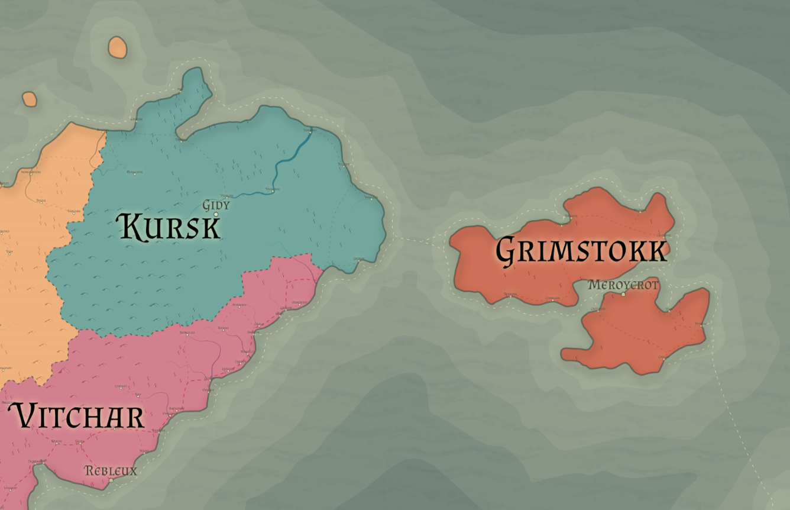

# Kursk

Racial Majority: Dwarven (Mountain dwarves), Goblins

Geography: Mountain region, rocky, barren

Kursk is defined by war. For centuries, they have fought to push back the goblins that occupy the southern end of the Kyrgann mountain range.  They prize quality metalwork, especially weapons and armor crafting.  All dwarf children are trained as warriors from a young age and required to serve on the frontlines.  Rather than requiring a minimum number of years of service, dwarves must remain on the frontlines until they have killed a minimum number of goblins (the required number changes depending on the state of the war).  

Kursk is ruled by a queen who has supreme authority – her word is not questioned and she commands total respect. Kurskan dwarves are a matriarchal society, both in their government and family structure.  Each established dwarven family is run by a matriarch, the most powerful of which often advise the queen or act as her officers.  It is uncommon for male dwarves to hold any positions of power in the Kurskan army, as female dwarves are generally better warriors and shrewd commanders.

Most crafters in Kursk focus on weapons, armor, or other martial products, but some spend their time crafting jewelry, ornate furniture, glasswork, elaborate stonework, or other fine goods.  These crafters hold lower status in society and justify their pursuits by funding the war effort with profits from exporting their finished works to other regions.  Some crafters even choose to leave Kursk completely and move to another region (usually Vitchar) where their craft is more respected.  Unless they regularly send money back to Kursk to fund the war, they are considered “dvurkist”, which is most accurately translated as “warped-sword-traitor”, with the cultural context of swords being weapons for weaker races.
