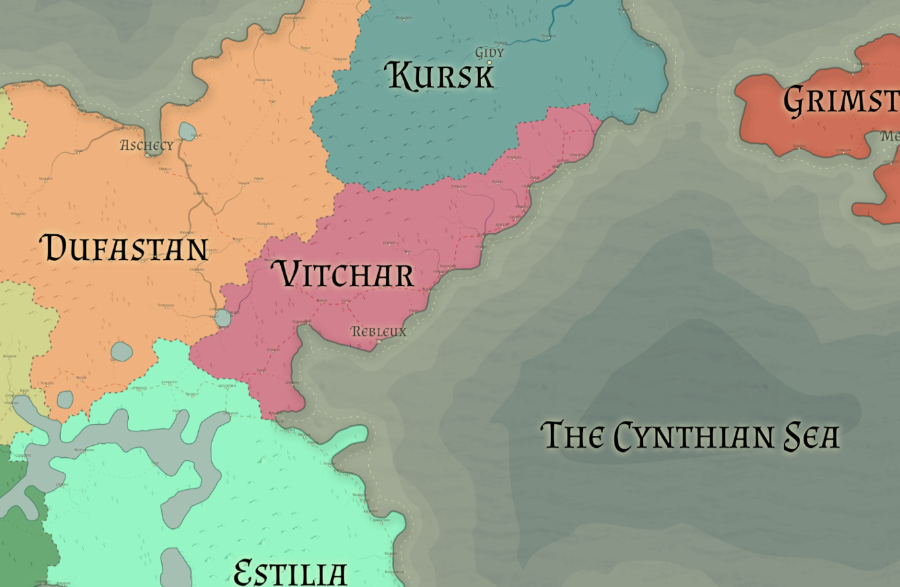

# Vitchar

Racial Majority: Human/Half-Elven

Geography: Mediterranean, vineyards, wine country

Vitchar is a coastal nation, one of the few in Eryst that boasts a multi-racial culture.  Half-elves and humans live side-by-side in the port cities of Vitchar and control most of the wealth in the region.  Wine drives both trade and politics - the wealthiest residents own large estates (usually vineyards) slightly inland in the low hills near the coast. The government is run by the Financial Regent, who is elected by the Merchant’s Guild once every 3 years.

The mix of booming trade, lavish wealth, and constant political turmoil naturally attracts crime – indeed, the Thieves Guild has a strong presence in all Vitcharian cities.  They provide “protection” for small businesses and hire out to anyone able to pay for their services.  Wealthy families looking to secure the position of Financial Regent will often hire the Thieves Guild as election time approaches, using the varied skills of its members to make their political opponents appear weak and incapable of rule.  Even the oldest, most established Vitcharian families are merchants at heart and value stability over all else - after all, stability means good trading for those already at the top.

Wine is Vitchar’s major export, but their ports boast exotic goods from faraways lands as well as opulent gems and fine metalwork from the Dwarven kingdom of Kursk.  Southern Vitcharian cities have a small but healthy market for the more common magical items from Estilia.

Blood and wine flow freely on the streets of Vitchar, attracting evil beings with a delight for gluttony, debauchery, and revelry.
